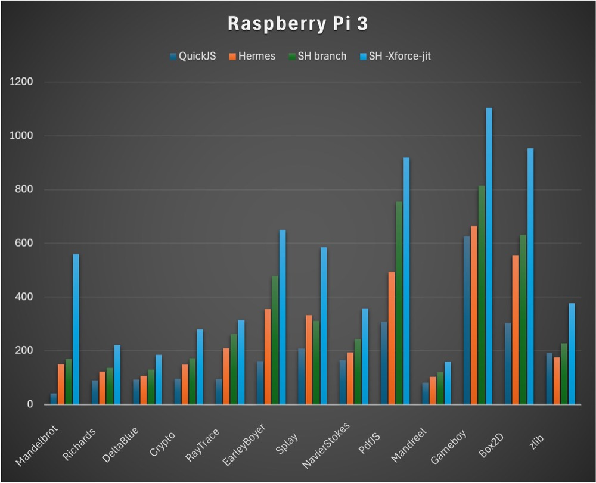
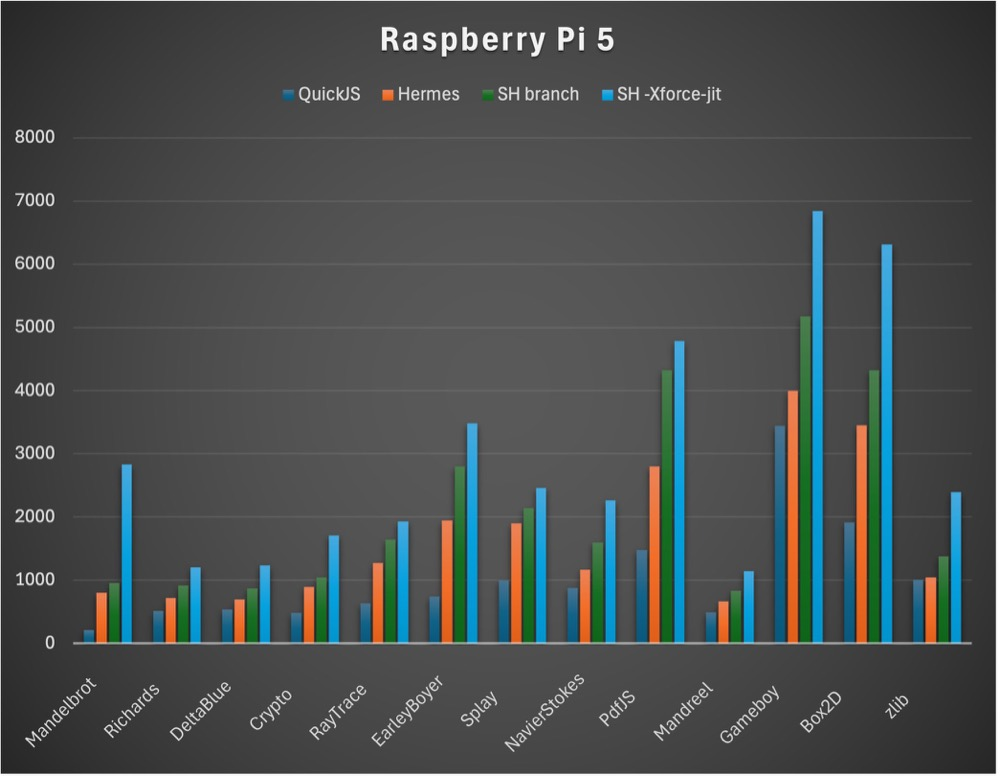

# Octane Benchmark Results: Hermes JIT Progress

*November 9, 2024 · tmikov*

In parallel with typed JS, we have also been making progress on untyped (legacy) JS performance.

These are Octane benchmark results comparing original Hermes, the static_h branch, and static_h branch with JIT. I also added QuickJS for reference. The TypeScript benchmark was removed because it is too high.

The benchmarks were run on Raspberry Pi 3 and Pi 5 to encompass a wide range of performance.

This is all untyped, unannotated JS, not using the native backend.

To be clear, Octane is not representative these days, but we can't have good performance in more important cases if we completely suck at Octane. Higher scores are better.

