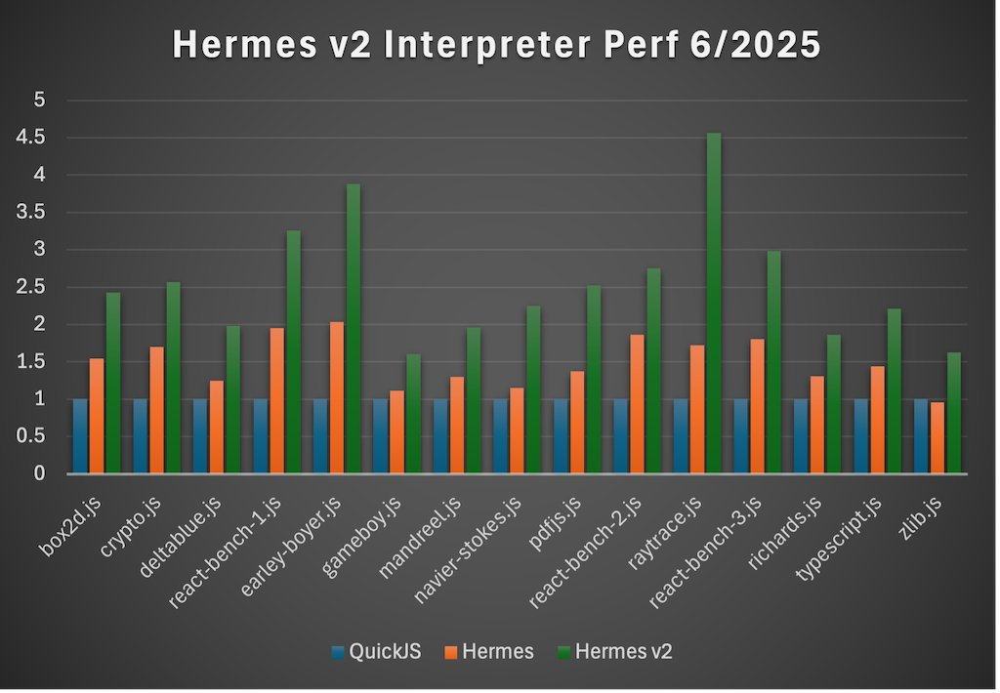

# Static_h Branch Performance: June 2025 Update

*July 15, 2025 · tmikov*

static_h branch performance at end of June 2025, relative to Hermes and QuickJS. Numbers are relative to QuickJS (1.2 means 1.2x faster); higher is better.

The measured Hermes v2 configuration is hv32+jit.

- **hv32** means the runtime uses compressed pointers and boxed doubles, when they don't fit in a 32-bit tagged value.
- **jit** means JIT 😅

QuickJS is used as a performance reference, since it is high quality, small, and spec compliant.

static_h branch hv32+interpreter performance, relative to QuickJS and Hermes (higher is better).

