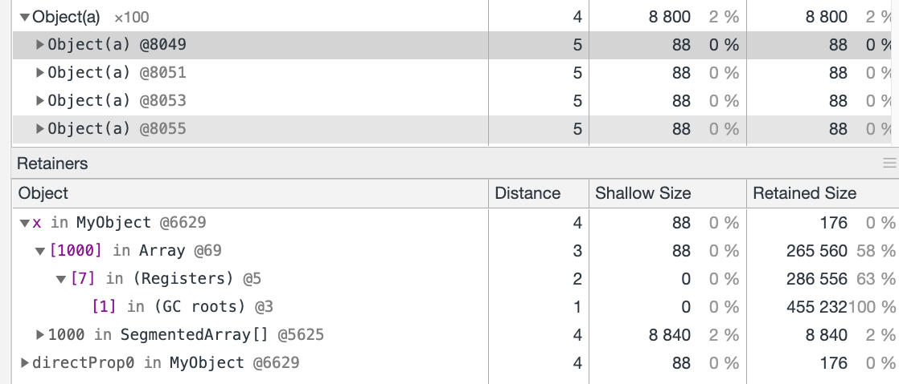
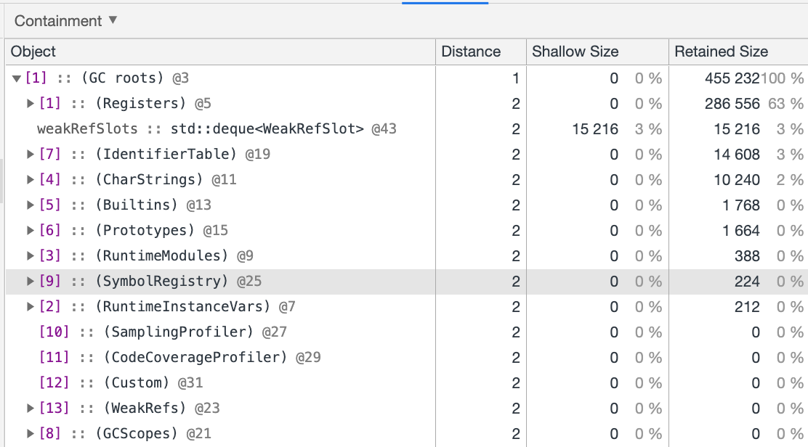

<!--
Note to editors adding new videos to this file: upload to
assets.hermesengine.dev instead of using local files. Videos will increase the
clone size for everyone who clones Hermes.
-->

This page describes the various tools you can use to diagnose memory issues in
your app using Hermes. The tools can be used in a variety of ways based on
your needs.

The main goal of these profilers are to help you identify ways your app can
reduce its memory footprint. This is important for improving the user experience
in many ways:

* Your app can run faster and have fewer, less expensive garbage collection
cycles
* Your app can avoid running out of memory entirely, and crashing with an Out of Memory (OOM) error
* Your app can avoid being killed by the operating system for using too much memory

# Heap Snapshots

A Heap Snapshot is a view of the entire JavaScript heap at a point in time. It
represents the data as a graph, where nodes are the values in the heap, and the
edges are pointers from one node to another. The snapshot can answer these types
of questions:

* What types of values is my app using?
* How much memory do those values use?
* What memory is being retained unnecessarily?

The nodes in the snapshot can be any value usable in JS, such as:

* Objects: `{a: 1, b: 2}`
* Arrays: `[1, 2, 3]`
* Functions: `function foo(args) { ... }`
* Strings: `"hello world"`
* Numbers: `3.14`
* Native host memory, injected into the heap via `jsi::HostFunction` and
`jsi::HostObject` in the JSI API
* Hermes-specific internal memory, such as `Environment`, `ArrayStorage`, and
`HiddenClass`, and the backing storage of ArrayBuffers.

Each node has a list of edges to other nodes, which can be used to determine
what nodes **retain** other nodes. If node A retains node B, that means if A
is reachable by your program, B will also remain reachable. Therefore, B cannot
be garbage collected until A is garbage collected.
Many heap snapshot viewers will define the difference between **shallow size**
and **retained size**. **Shallow size** is the size of just that node, whereas
**retained size** is the size of all the nodes the current node retains.

The snapshot format is a JSON file ending in `.heapsnapshot`, and is the same
format used by the Chrome Developer Tools and the V8 JavaScript engine. This
means all tools that work with heap snapshots taken from V8, Chrome, or Node.js
are also compatible with snapshots taken from Hermes.

In particular, you can take memory snapshots from the Chrome Developer Tools
connected to Hermes!

## Taking a heap snapshot with the Chrome DevTools

Before reading this section, make sure you can
[connect the Chrome DevTools to Hermes](https://reactnative.dev/docs/next/hermes#debugging-js-on-hermes-using-google-chromes-devtools)
to debug some JavaScript. Once you have that set up you can proceed.

1. Open the "Memory" tab of the DevTools, and make sure the "Heap snapshot" radio
button is selected
1. (Optional): Click on the garbage can icon in the top left to collect any
unreachable objects. This will prevent them from showing up in the snapshot.
1. Click on "Take snapshot"

<video autoplay muted loop controls height="auto" width="100%" alt="Take a heap snapshot from Chrome">
  <source src="https://assets.hermesengine.dev/chrome_take_heap_snapshot.mp4" type="video/mp4" />
  Your browser does not support the video/mp4 encoding.
</video>

Chrome will alert Hermes that a snapshot is requested, and Hermes will stream
the snapshot JSON file back to Chrome. This may take some time if you have a
large heap. Once it's completed, you can go to the
[Using the Chrome DevTools Heap Snapshot Explorer](#Using-the-Chrome-Devtools-Heap-Snapshot-Explorer)
section to start reading it.

You can save the snapshot to disk by pressing the "Save" button on your snapshot
in the Chrome menu:

<video autoplay muted loop controls height="auto" width="100%" alt="Save heap snapshot to disk from Chrome">
  <source src="https://assets.hermesengine.dev/chrome_save_heap_snapshot.mp4" type="video/mp4" />
  Your browser does not support the video/mp4 encoding.
</video>

## Taking a heap snapshot from C++

Using the Chrome DevTools only applies when you have attached a debugger. For
various reasons, it might be hard to do that for your app. In those cases, you
can write some C++ code to ask Hermes for a heap snapshot.

Before reading this section, make sure to read the JSI documentation which
explains all of the basics of the API.

Now, say you have some Native Module in React Native, and you want to create
a heap snapshot. Here's what you do:

```cpp
void myFunc(jsi::Runtime &rt) {
  // If you want to write to a file name, use createSnapshotToFile.
  rt.instrumentation().createSnapshotToFile("/tmp/filename.heapsnapshot");
  // If you already have a C++ std::ostream set up, use createSnapshotToStream.
  rt.instrumentation().createSnapshotToStream(std::cout);
}
```

This method gives you a lot of flexibility of when and where you want to set up
your heap snapshots. You can also expose the functionality above through a
`jsi::HostFunction` and call it from JS. The downside is you'll need to add a
new native module and build React Native from source for your app.

## Taking a heap snapshot from JavaScript with the Hermes CLI

Currently, it isn't possible to take a heap snapshot from JavaScript unless you
are running hermes via the command line interface.

If you are running from the command line interface, there's a function defined
on the global object called `createHeapSnapshot`, used like so:

```js
// Calling with no arguments will print to stdout
createHeapSnapshot();
// Calling with a single string argument will write the snapshot to that file
// path. If it isn't a valid file, or the permissions won't allow Hermes to
// write to it, it'll throw a TypeError
createHeapSnapshot("/tmp/filename.heapsnapshot");
```

Note that `createHeapSnapshot` does not exist if you are running Hermes in
React Native, or if Hermes was built without memory instrumentation, and
you will get an exception if you try to use it.

## Loading a heap snapshot from disk

If after any of the above methods you have a `filename.heapsnapshot` file saved
somewhere, you can load that into Chrome without needing to connect to any
running app. From the "Memory" tab, next to "Take snapshot" there is a "Load"
button which will open a file browser. Navigate to the file you want to load
and open it.

## Using the Chrome DevTools Heap Snapshot Explorer

Now you have a heap snapshot taken and you want to find a memory problem. Here's
an explanation of what you can do in Chrome.

### Sorting

You can sort by any of the following categories by clicking on the category
name:

* Retained Size: size of all nodes pointed to by this node
* Shallow Size: size of just the node itself
* Constructor: The name of the constructor of the node. Can think of it as a
type name
* Distance: The number of edges needed to traverse from a root to this node

Click a second time to reverse the order of the sort.

### Type names
You can search for a type name, which uses the name of the constructor function
by default. For example, if you have code like the following:

```js
function MyObject() {}
var obj = new MyObject();
```

The node for `obj` in the snapshot will have the constructor name `MyObject`.
Expanding the type category will show all objects that are in the heap of that
type.

Hermes tries to be as specific as it can with type names for objects. For
objects created without a constructor, such as object literals
(`{a: 1, b: "hello"}`), Hermes will display its type name as `Object(a, b)`. If
an object has more than 5 properties, it will be displayed as
`Object(a, b, c, d, e, ...)`. If an object has more than
`HiddenClass::kDictionaryThreshold` properties (currently 64), it will be
displayed as `Object(Dictionary)`.
Warning: If you change the name of the constructor function dynamically, or if
the `.name` property of a function is an accessor, Hermes may only report the
original name of the function as defined in the source file.

### Retainers

If you click on a particular object in your snapshot, a drawer will pop up below
saying "Retainers". This drawer will show a tree of all nodes that have a
reference to this node.

If you click on the dropdown arrow for one node, you'll see all of the other
nodes which retain that node, and so on until you reach what's called a "root"
of the heap. You can also right-click on a node in the retainers drawer and
click on "Reveal in Summary view" to jump to that node in the summary box.



In this example, you can see that an object (who has an "a" property), is
retained by the property "x" in an instance of MyObject. That object is retained
by the 1,000th element in an array. That array is retained by `(Registers)`,
which is the root category for all local variables on the JS stack.

Below you can see some more of the root categories that Hermes uses to describe
some things that can retain objects:



The most important ones are:

* `(Registers)`: all local variables on the JS stack
* `(IdentifierTable)`: a table of strings used as object properties and symbol
descriptions
* `(GCScopes)`: the equivalent of the `(Registers)` group for native code inside
the Hermes engine. These hold onto JS values currently in use by native code
* `(Prototypes)`: lists of prototypes and constructors of system objects like
`Function` and array iterators
* `(Custom)`: these are any roots created by native code outside of Hermes. In
the case of any embedder using JSI (such as React Native), this corresponds to
the `jsi::Value`s being used
* `(SymbolRegistry)`: this is a table of all symbols made by `Symbol.for("foo")`

Knowing which root anchors your node is an important step to knowing why it is
being retained, and if it shouldn't be. If an object doesn't have a retaining
path to the root, it means there is nothing keeping it alive, and it will be
collected at the next garbage collection cycle.

Outside of root categories, there is another frequent retainer of objects:
the `Environment` type. An `Environment` in Hermes is a simple array that is
used to store captured variables of a closure. In this example you can see that
the variable `x` is captured:

```js
function makeCallback(x) {
  return () => x;
}
```

The closure returned from `makeCallback` will capture `x`, and Hermes implements
this by placing `x` into an `Environment` pointed to by the closure.
Environments can be shared if multiple closures capture the same variable:

```js
function makeManyCallbacks(x) {
  return [() => x = {foo: 1}, () => x.foo];
}
```

In this case, both closures will capture the same environment pointing to `x`,
so the second closure will see updates made by the first closure.
Taking a snapshot of some objects created by calling `makeManyCallbacks` shows
the following:


The `[1] in Array` shows this was the second closure stored in the array.

### Comparing Snapshots

If you have two heap snapshots from the same execution you can compare them to
each other and see which objects were allocated or destroyed between those
points in time.

First, load two snapshots into your Chrome workspace. Make sure they are from
the same process. Two snapshots from two separate runs of your app will not be
comparable, and the output might not make sense.

Then, click on the "Summary" dropdown box at the top and change it to
"Comparison". If you don't see the "Comparison" option that means you don't have
two snapshots loaded into Chrome yet. The following video shows how to do this:

<video autoplay muted loop controls height="auto" width="100%" alt="Heap Snapshot Comparison Video">
  <source src="https://assets.hermesengine.dev/chrome_save_heap_snapshot.mp4" type="video/mp4" />
  Your browser does not support the video/mp4 encoding.
</video>

Once you're in a comparison view, you can see what objects were created since
the last snapshot represented by a `+` icon, and what objects were destroyed
represented by a `-` icon. The columns are as follows:

* `# New`: Number of new objects created of a particular type
* `# Deleted`: Number of objects deleted (garbage collected)
* `# Delta`: New - Deleted. Positive means more were created than deleted.
* `Alloc. Size`: Size of all newly created objects of that type added together
* `Freed Size`: Size of all deleted objects of that type added together
* `Size Delta`: Alloc. Size - Freed Size. Positive means more bytes were created
than deleted.

Typically sorting by `Size Delta` is the most useful for hunting down memory
regressions. A large positive value means a lot of extra bytes were allocated
for that type of object.

Expanding the type category will show for each object ID, whether it was new
or deleted, and the size it was.

### Statistics View

From the same dropdown menu for selecting "Summary" or "Comparison", you can
also select "Statistics", which shows a pie chart of various memory categories.
This view only accounts for a few limited categories of memory, and doesn't have
any way to drill down into the category to see more, so this view is of limited
use.

# Heap Timelines

TODO: Fill out this section.

# Sampling Heap Profiler

TODO: Fill out this section.
